<!-- Header -->

<h3>AI Agent Developer</h3>

**안성재 (An Seongjae)**

seongjae.an98@gmail.com · [Velog](https://velog.io/@sammy0329) · [LinkedIn](https://www.linkedin.com/in/seong-jae-an-39957a3b0)

---

## About Me

> **"AI 도구를 레버리지 삼아, 먼저 빠르게 만들고 학습합니다."**

Claude Code, Cursor 같은 AI 도구를 활용해 아이디어를 빠르게 프로덕션까지 끌어올리는 개발자입니다.
모르는 기술도 AI와 협업하며 실전에서 익히고, 완성된 결과물로부터 역으로 깊이를 쌓아갑니다.

---

## Tech Stack

**Languages & Frameworks**

**Database**

**Infra & Deploy**

**AI Tools**

---

## Projects

### 삼양식품 AI 마케팅 에이전트

> **숏폼 트렌드 수집 / 크리에이터 매칭 / 콘텐츠 아이디어 생성을 자동화하는 AI 에이전트 플랫폼**

**기간:** 2025.12.12 ~ 2025.12.14 (3일) · **역할:** Fullstack (개인 프로젝트)

- 3일 만에 기획 → 개발 → 배포 완료 — Claude Code 명세 기반 개발로 속도 확보
- AI 에이전트 3개(트렌드 분석 / 크리에이터 매칭 / 콘텐츠 생성) 설계, Zod 스키마로 응답 구조 강제하여 파싱 실패율 제거
- SHA256 해시 + Redis 캐싱으로 동일 요청 시 AI 호출 스킵 → API 비용 절감
- Supabase RLS로 사용자별 데이터 격리 / IP 기반 Rate Limiting으로 남용 방지
- YouTube Data API 연동하여 실시간 플랫폼 트렌드 데이터 수집 파이프라인 구축

[Repository](https://github.com/sammy0329/samyang-rnd-ai-agent) · [Portfolio](https://enchanting-ghost-b55.notion.site/WEB-Samyang-Viral-Insight-Agent-2f02cb75da7b8090bc2bf22ad2b874ae)

---

### AI 리뷰 분석 에이전트

> **22만 건 이커머스 리뷰를 AI가 분석하여, 사용자 질문에 근거 기반 답변을 제공하는 RAG 멀티 에이전트 시스템**

**기간:** 2026.01.10 ~ 2026.01.14 (5일) · **역할:** Fullstack (개인 프로젝트)

- LangGraph 기반 의도 분류 → 에이전트 라우팅 시스템 구축, Pydantic 스키마로 LLM 응답 구조 강제하여 파싱 실패율 제거
- 시맨틱 캐싱(코사인 유사도 70% 임계값)으로 응답 시간 2.8초 → 0.4초(85% 단축), API 비용 절감
- 하이브리드 의도 분류(규칙 + LLM Fallback)로 명확한 질문은 즉시 라우팅, 모호한 질문만 LLM 호출
- 규칙 기반 + LLM 2단계 가짜 리뷰 필터링, confidence 기반 가중치 조절로 검색 품질 확보
- "이 제품 건조한 피부에 괜찮아?" 같은 자연어 질문에 실제 리뷰 근거를 인용해 답변 생성

[Repository](https://github.com/sammy0329/ai-review-analyst) · [Portfolio](https://enchanting-ghost-b55.notion.site/WEB-AI-Review-Analyst-Smart-Buying-Decision-Agent-2f02cb75da7b8076a334dd34e461cc62)

---

### InBody 멀티모델 기술 지원 에이전트

> **InBody 체성분 분석기 4개 기종의 기술 지원을 자동화하는 LangGraph 기반 멀티 에이전트 RAG 시스템**

**기간:** 2026.01.30 ~ 2026.02.02 (4일) · **역할:** Fullstack (개인 프로젝트)

- LangGraph StateGraph 기반 워크플로우 - 의도 분류 → 시맨틱 캐시 조회 → 전문 에이전트(Q&A / 요약) 라우팅
- 3계층 기종 격리(컬렉션 분리 + 메타데이터 필터 + 후처리)로 기종 간 정보 교차 오염 방지
- RAG(PDF 매뉴얼 벡터 검색) + Tool Calling(에러코드/주변기기 SQLite 조회) 하이브리드 구조로 질문 유형별 최적 데이터 접근
- 4단계 가드레일(면책 문구 / 기종 누출 감지 / 안전 차단 / LLM 정합성 검증)으로 할루시네이션 방지

[Repository](https://github.com/sammy0329/InBody-Multi-Model-Technical-Support-Agent) · [Portfolio](https://enchanting-ghost-b55.notion.site/Web-InBody-Multi-Model-Technical-Support-Agent-3062cb75da7b80318f56cffbaf1a4f76)

---

### 백준 알고리즘 일일 추천 & AI 코드 리뷰 Slack 봇

> **AI(GPT·Claude·Gemini) 코드 리뷰와 백준 문제 추천을 자동화하는 AWS Lambda 기반 서버리스 Slack 봇**

**기간:** 2026.02.22 ~ 2026.02.24 (3일) · **역할:** Fullstack (개인 프로젝트)

- Lambda 비동기 호출 패턴(`InvocationType: Event`)으로 Slack 3초 응답 제한 해결 - WorkerFunction이 SlackEventsFunction과 독립적으로 AI 처리 수행
- esbuild Minify + PreWarm 트리거 + 메모리 최적화로 콜드 스타트 최대 -32%, 실행 비용(GB-초) -63% 달성
- AI(GPT · Claude · Gemini)를 Factory 패턴으로 추상화 - DynamoDB 설정 항목 하나로 코드 변경 없이 런타임 AI 전환
- DynamoDB 단일 테이블 설계로 7가지 액세스 패턴을 GSI 없이 PK/SK 조합만으로 해결
- HMAC-SHA256 서명 검증 · 멱등성 체크 · 일별 요청 제한으로 위조·중복·남용 요청 차단
- AWS SAM IaC로 Lambda · API Gateway · EventBridge · DynamoDB · SQS DLQ 전체 인프라를 코드로 정의

[Repository](https://github.com/sammy0329/algo-daily-bot) · [Portfolio](https://enchanting-ghost-b55.notion.site/Daily-Algo-Slack-bot-3122cb75da7b80f89538f625486213ed) · [Blog](https://velog.io/@sammy0329/series/Project-algo-daily-bot)

---

## How I Work with AI

> AI에게 명확한 맥락을 먼저 제공하면, 방향이 흔들리지 않고 수정 루프가 줄어듭니다.
> 그래서 코드 작성 전에 **개발 환경을 설계하는 데 먼저 집중합니다.**

프로젝트의 불변 원칙 / 기능 요구사항 / 기술 제약을 명세로 정의하고,
브랜치 전략 / 커밋 규칙 / 코드 컨벤션 / PR·Issue 템플릿 / 커스텀 커맨드까지
프로젝트 워크플로우 전체를 설정 파일로 관리합니다.

AI가 이 설정을 기반으로 동작하기 때문에, 코드 스타일부터 PR 작성까지
사람이 반복 확인하지 않아도 일관된 품질을 유지할 수 있습니다.

**사용 도구:** [spec-kit](https://github.com/nicepkg/spec-kit) · [everything-claude-code](https://github.com/anthropics/claude-code)

---

## GitHub Stats

---

## GitHub Metrics

---

